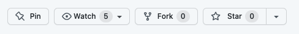
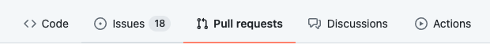

# Guide for Contributors

This page explains how to contribute an example to the CUAHSI Gallery. The
sections below provide a step-by-step guide that should be followed in
numerical order.

## 1. Fork this Repository

The first step is to fork this repository under your own GitHub account. This
will enable you to make changes to the Gallery code, after which you can
request that they be included in the production CUAHSI gallery website.

To fork this repository, simply select the "Fork" button in the top right
corner of the repository interface.



After forking, clone the codebase from your new repository. As you make
changes, commit and push these to your repository.

## 2. Create a Directory for your New Example

All gallery content follows a consistent directory structure;
`[root]/Sub-Gallery/Category/Example`, where

- `root` is the root directory of the gallery, i.e. `source/gallery`
- `Sub-Gallery` is a grouping categories around a programming language or
  technology, e.g. `Python`, `R`, `ShinyR`.
- `Category` is a grouping of examples around a similar theme or topic, e.g.
  `Instructional`, `Research`.
- `Example` is a directory containing the configuration and supporting files
  for a single example. The name of the example folder should be lowercase,
  self-descriptive, and contain no spaces.

All content within the Gallery must must follow the pattern. The category and
sub-gallery that you choose is dependent on the example and together define
where the example is displayed in the gallery. While, new sub-galleries and
categories can be created, contributors are encouraged to use existing ones
wherever possible. For example, a instructional notebook that demonstrates
using the Python Pandas library for a data science application would be located
in:

``` text
- source
  - gallery
    - Python
      - Instructional
        - <title-of-my-example>
```

### Directory Structure

After choosing a location creating the directory to hold your example,
populated it with the following files.

1. `conf.yaml`: a yaml configuration file that is used to populate the metadata
   for your example on the website. The contents of this file are described in
   detail in [configuration-options.md](./configuration-options.md). All links included in user defined fields should open in new tabs by default.

2. A thumbnail image that will be displayed in the gallery, e.g.
   `thumbnail.png`. Use a eye-catching and visually appealing (but relevant)
   image that gives a preview of example results.

3. A directory for code, data, and/or notebooks that will be rendered on the
   page, e.g. `/notebooks`. Place any relevant content for your example in this
   directory, it will be referenced in the configuration file.

There are many options for configuring your example, read through the
[configuration guide](configuration-options.md) for a full list options.

### Build the Gallery

Build the gallery on your local machine by following the local development
instructions in the [README.md](../README.md). Once everything is appearing
the way you like, proceed to the next step.

### Merge your Example

Since your code is located in a fork of the Gallery, you need to request that
it is included (i.e. merged) into the production web site. This is done via
Pull Requests.

Create a Pull Request to merge your code into the CUAHSI/Gallery repository by
first selecting the "Pull requests" menu item in GitHub



then, open a "New pull request"


When creating your pull request, make sure that "base" branch is `develop`.
Also make sure to include a summary of your changes to make the code review
process as seamless as possible.

Issuing a pull request will notify CUAHSI staff to review your code and
example. Once your contributions have been reviewed they will be merged into
production Gallery website and will be publicly available. Note, you may be
asked to make changes prior to your work being merged.

