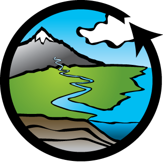

.. toctree::
   :maxdepth: 1
   :glob:

   source/gallery/Matlab/index

|foo| **CUAHSI Compute and Modeling Gallery**
=============================================

..
  This is where we construct the homepage thumbnail panels.
  For more details, see https://sphinx-panels.readthedocs.io/en/latest/ 

.. panels::
    :card: shadow
    :img-top-cls: pl-5 pr-5
    :column: col-lg-6 col-md-6 col-sm-6 col-xs-12 p-2

    ---
    :img-top: _static/python-logo.jpeg

    Community examples using the Python programming language. This includes both Python scripts as well as Python Jupyter notebooks.

    .. link-button:: python-gallery
        :type: ref
        :text: Python Gallery
        :classes: btn-outline-primary btn-block stretched-link

    ---
    :img-top: _static/matlab-logo.jpeg

    Community examples using the MATLAB programming language. This includes MATLAB \*.m scripts as well as MATLAB Live scripts.
    
    .. link-button:: Matlab-gallery
        :type: ref
        :text: MATLAB Gallery
        :classes: btn-outline-primary btn-block stretched-link
    ---
    :img-top: _static/r-logo.jpeg

    Community examples using the R programming language. This includes R Jupyter notebooks, R scripts, as well as R Shiny web applications.

    .. link-button:: R-gallery
        :type: ref
        :text: R Gallery
        :classes: btn-outline-primary btn-block stretched-link

..
    This is an example of a subgallery panel
    ---
    :img-top: _static/r-logo.jpeg

    .. link-button:: examples/r
        :type: ref
        :text: Spatial Plotting with RGdal
        :classes: btn-block stretched-link

